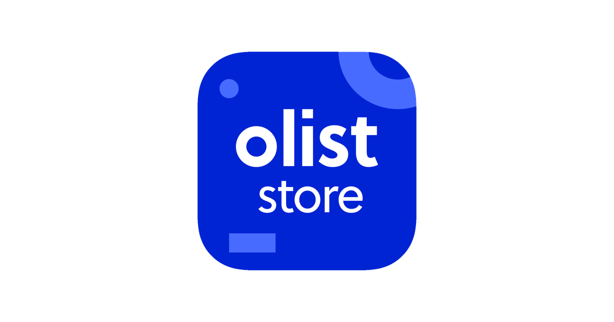
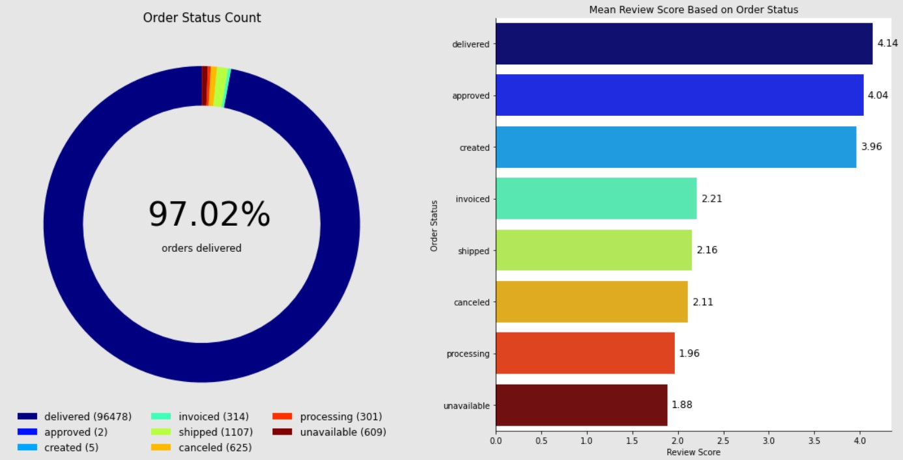
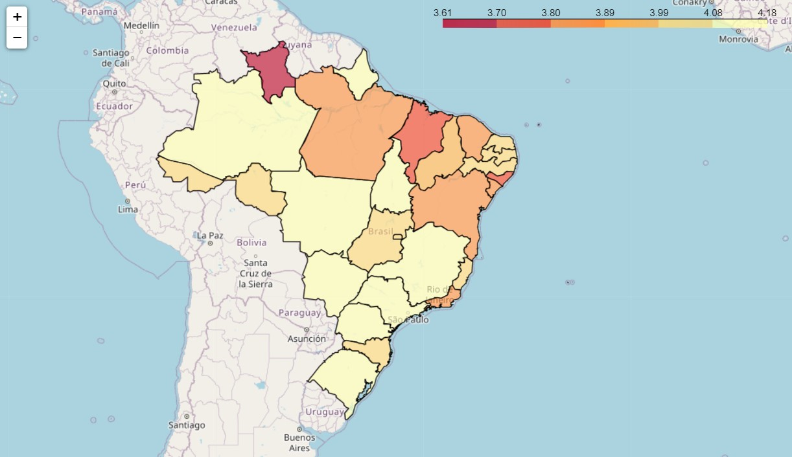
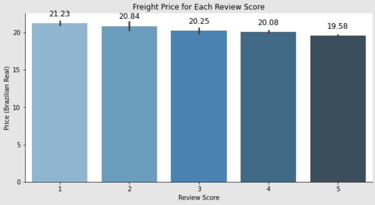
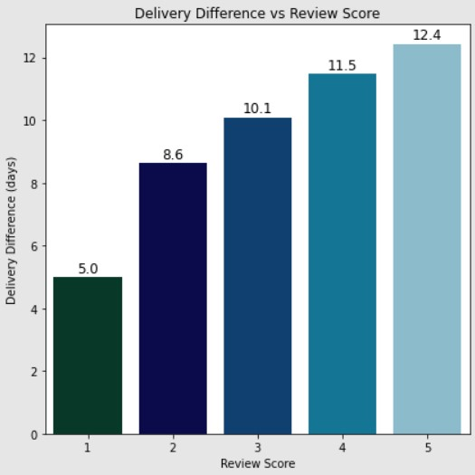
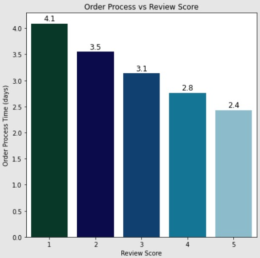
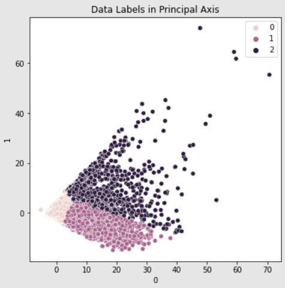

# Olist Store Review Score Analysis and Customer Segmentation
Contributor:
* Brian Giovanni (brian.giovanni2807@gmail.com)
* Rizqi Irfan Nawwaf (R.irfannawwaf@gmail.com)

This notebook is about the review score analysis and customer segmentation of Olist Store (Brazilian e-commerce). The dataset itself is provided through Kaggle and can be viewed using this
[link](https://www.kaggle.com/olistbr/brazilian-ecommerce?datasetId=55151&sortBy=voteCount).

There are some features that can't be displayed in the github viewer (folium Map). As an alternative, you can view the notebook using 
[NBViewer](https://nbviewer.jupyter.org/github/PurwadhikaDev/ScikitLearnGroup_JC_DS_BSD_JKT_13_FinalProject/blob/main/Olist%20Store%20Review%20Score%20Analysis%20and%20Customer%20Segmentation.ipynb)
.

## Table of contents
* [Introduction](#introduction)
  * [Background](#background)
  * [Problem Statement](#problem-statement)
* [Technology](#technology)
  * [Language](#language)
  * [Libraries Used](#libraries-used)
* [Work Steps](#work-steps)
* [Conclusions and Recommendations](#conclusions-and-recommendations)
  * [What Makes A Low or High Review Score](#what-makes-a-low-or-high-review-score)
  * [Customer Segmentation](#customer-segmentation)
* [External Links and References](#external-links-and-references)

## Introduction
This project is about review score analysis and customer segmentation of Olist Store which is used in Brazil.

### Background
The main objective of an e-commerce is to increase revenue. One of the most cruical aspects in increasing revenue is the review score.
Review score is not only have the power to influence consumer decisions but can strengthen a company’s credibility. Review score have the power to gain customer trust, and they encourage people to interact with the company. Customer interaction ultimately leads to improved profits for businesses [[source](https://medium.com/revain/why-are-customer-reviews-so-important-185b915d4e5d)]. Hence, in this notebook we are trying to see what kind of properties that affect the review score given by the customers.
As an addition, we would also like to see what type of customer are using the Olist Store in order to create a more targetted strategy to the customers.

### Problem Statement
Based on the background, we can conclude 2 problem statement as shown below.
* What makes a low or high review score ?
* What type of customer is using the Olist Store's service ?
	
## Technology
### Language
This project is created using Python 3.8.5 programming language.

### Libraries Used
List of libraries used in the notebook are listed below.
* Numpy 1.21.1
* Pandas 1.1.3
* Matplotlib 3.4.2
* Seaborn 0.11.0
* SciPy 1.5.2
* Folium 0.12.1
* Scikit-learn 0.24.2

## Work Steps

1. Import Libraries and Datasets
   First, we imported the libraries needed through the notebook and also the dataset. There are 9 datasets imported, so a merging of a dataframe is needed to simplify the data processing step.
2. Merge Datasets
   In this step, we merge the 9 datasets into a single master dataset called df_merged. The data scheme for the merging process is shown below. In this stage we also do some feature engineering 
   to simplify some features in the dataset.
  
   
  
3. Exploratory Data Analysis and Review Score Analysis
   In this step we see the distribution of the numerical data of the master dataset. It is concluded that the numerical data is not normally distributed and have a lot of outliers.
   We also do the review score analysis and obtained the features that affect the review score as shown below.
   * Order Status (undelivered orders tend to lower the review score)
	
   * Geographical Location (northern customers tend to rate the orders with a lower review score)
	
   * Freight Price (higher freight price tend to be rated lower)
	
   * Delivery Difference (lower delivery difference tend to be rated lower as well)
	
   * Order Processing Time (higher order processing time tend to lower the review score)
	
    
  
4. Preprocessing
   In the preprocessing step, we drop categorical features since most of the categorical features is irrelevant to the customer segmentation and we drop some numerical features
   that irrelevant as well. After the features is dropped, we impute the missing values inside the dataset with the median of each features since the numerical features is not
   normally distributed. At the end of this step, we scale the dataset using the RobustScaler to minimize the influence of the outliers.
   
5. Unsupervised Machine Learning
   In this step, we perform PCA to reduce the dimensionality of the data in order to minimize the space and time needed for the process. There are 2 principal components that
   were used for the next process since these 2 principle components is enough to describe the data (66 % explained variance). 
   
   For the next step, we perform Elbow Method and Silhouette Score to choose the optimal number of clusters for the KMeans models. The optimal number of clusters obtained is 3.
   Then, KMeans Clustering is performed and the resulting labels is assigned back to the original dataset.
   
   
   
   
   In conclusions, there are 3 types of customer that were using the Olist Store which are:
   * Cheap Product Buyers: customers that tend to buy cheap products
   * Heavy Product Buyers: customers that tend to buy large and heavy products
   * Expensive Product Buyers: customer that tend to buy expensive products

## Conclusions and Recommendations
### What Makes A Low or High Review Score?
Based on the Exploratory Data Analysis, these are the aspects that affect the review score given by the customers:
* Order Status
* Geographical Location
* Freight Price
* Delivery Difference
* Order Processing Time

In order to increase review score, some solution that might be considered are listed below.
* Give title to fast and reliable sellers in order to reduce the number of undelivered orders (cancelled, processing, unavailable)
* Encourage sellers from the northern of Brazil to use the Olist Store so that the freight price can be minimized for the customer in northern of Brazil
* Partner with a better logistic company to increase delivery performance (reduce delivery delays) and reduce freight price
* Giving a promo about the freight price could also help to increase review score, since people tend to be happy when the freight price is low
* Create a faster and more reliable ordering systems in order to reduce the time needed to process an order

### Customer Segmentation
As for customer segmentation, we can divide the customers into 3 groups which are:
* Cheap Product Buyers
* Heavy Product Buyers
* Expensive Products Buyers

Some solutions and recommendations that can be considered for each type of customers are shown below.
* For Cheap Product Buyers:
    - Give more recommendations or ads about:
        - bed, bath, and table
        - health and beauty
        - sports and leisure
        - furnitures and decorations
        - computers accessories
    - Bundle products to reduce recurring pain points

* For Heavy Product Buyers:
    - Give more recommendations or ads about:
        - office furniture
        - housewares
        - furnitures and decorations
        - bed, bath, and table
        - garden tools
    - Colaborate with local or international banks to provide zero interest installment
    - Partner with a logistic company that specifically great at transporting large items

* For Expensive Product Buyers:
    - Give more recommendations or ads about:
        - watches and gifts
        - computers
        - computers accessories
        - health and beauty
        - automotive
    - Colaborate with local or international banks to provide zero interest installment
    - Give a certain discount or promo when the purchase price exceeded certain value

## External Links and References

* https://www.kaggle.com/olistbr/brazilian-ecommerce?datasetId=55151&sortBy=voteCount
* https://www.kaggle.com/thiagobodruk/brazil-geojson
* https://www.helpscout.com/blog/cheap-customers/
* https://blog.hubspot.com/service/customer-retention-rate
